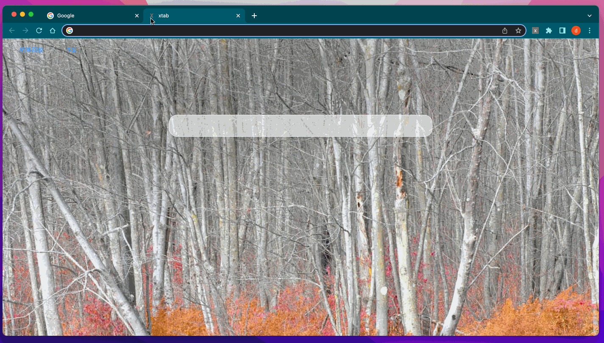
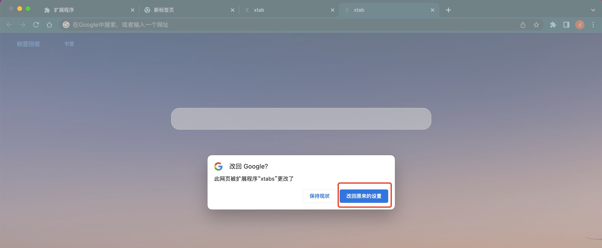

# XTab

`Chrome` 标签效率工具.

## 可以做什么?

### 标签自动回收

帮助我们自动关闭浏览器中很久未使用的标签, 防止浏览器越来越多的标签页, 无从寻找的窘境, 并可以在`回收站`中打开已回收的标签.


### 标签自动分组

帮助我们按照 `一级域名`, `二级域名` 或 `自定义规则` 对标签进行自动分组, 让标签井井有条的排列.



### 中间页自动跳转

在 `知乎`, `微信`, `简书`, `掘金` 等网站打开三方地址时, 通常会有一个二次确认的中间页, xtab 可以帮助我们自动完成跳转, 可以在这里[提交](https://github.com/daodao97/xtab/issues/1)未支持的网站.


### 新标签页

新标签页会展示一张好看的图片, 当然如果你现在已经有了喜欢的新开页扩展, 可以在chrome中选择继续使用



> 新标签页的其他UI还尚不美观, 个人css能力不足, 如果有感兴趣的小伙伴可以一起开发.

## 如何安装


### 下载扩展包

[release](https://github.com/daodao97/xtab/releases)

### 自行编译

```shell
git clone https://github.com/daodao97/xtab.git
cd xtab
pnpm install
pnpm build

# 然后将 dist 目录拖入浏览器扩展管理页面
```